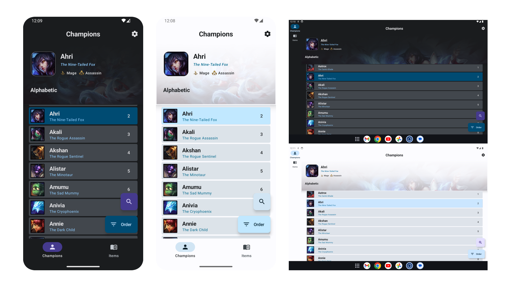

Learn Of Legends App 
====================

In order to share my knowledge and learn about the bests practices I build this application.

This repository is still a work in progress 🚧.

# Architecture

The `build-logic` folder defines project-specific convention plugins, used to keep a single
source of truth for common module configurations.
Inside `build-logic` is a `convention` module, which defines a set of plugins that all normal
modules can use to configure themselves.

The `core` module contains:
- `common`.
- `data`.
- `datastore`.
- `domain`.
- `model`.
- `network`.
- `ui`.

The `feature` module contains:
- `champion`.
- `champions`.
- `items`.
- `settings`.

It use **MVVM** design Pattern on **Multi-Module** project.

# Screenshots

# Tech

### Language
- Kotlin.
- Gradle (Kotlin DSL).
- Yaml (for GitHub Action Workflow).
- Proto (for model datastore).

### Common
- Coroutines.
- Kotlin Flow.
- Proguards.
- Secrets.
- Gradle Version Catalog.

### UI
- Jetpack Compose.
- Coil.
- Material 3 (dynamic theme).
- WindowSizeClass (responsive design for differents devices).
- WindowInsets (handle spacing for differents devices).
- SplashScreen.
- Lifecycle.
- Navigation.

### Network
- Retrofit.
- Kotlin Serialization.

### Storage
- DataStore.

### Dependencies Injection
- Hilt
- Hilt Navigation Compose.

### CI/CD
- GitHub Action workflow (build, push on repo, deploy on GooglePlayStore)

# License

**Learn of Legends** is distributed under the terms of the Apache License (Version 2.0).
